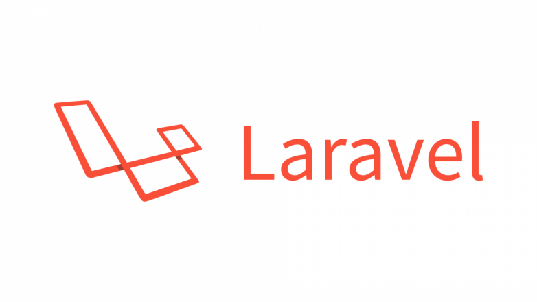

# Laravel Blog

Laravel Blog website with multiple functionalities

### Installing

Simply copy files with the same hierarchy in your server and move to the public folder and you will be fine.

## Functionalities

* Ability to create user accounts.
* Every user can create posts and read posts created by other users.
* Every user can update or delete his own posts.
* User can upload images with posts he create.
* Rich text editors are used when creating or updating posts.
* Posts can be tagged with different tags according to issues they discuss.

## Authors

* **Naje Yagoub Elfeel** 
